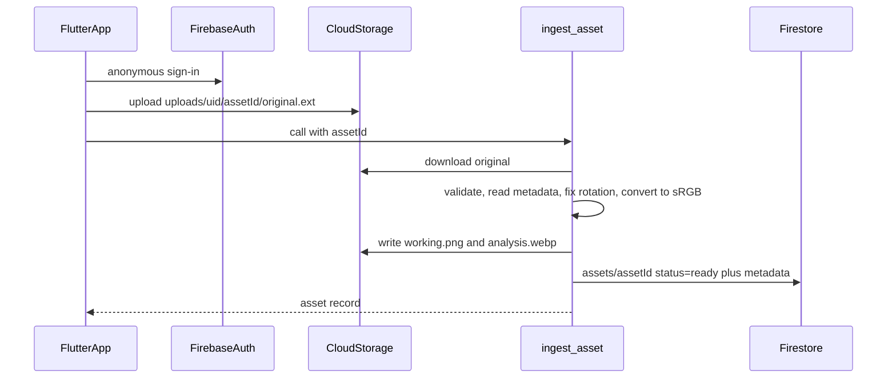

# Phase 0 + Phase 1: foundation and reference-slide ingest

Build the backend foundation on Firebase (Blaze) and Phase 1 of the V1 plan:
the app uploads one reference slide, and a Python Cloud Function stores the
original, normalizes it, makes a working copy and a smaller analysis copy, and
saves an asset record that the app reads back. No AI calls yet.

## Build checklist

- [x] Backend scaffold: `functions/` (venv on Python 3.12, requirements),
      `firebase.json` sections, Firestore and Storage rules, `.gitignore` entries
- [x] Ingest core: `functions/justpost/ingest.py` (validate, metadata, rotation
      fix, sRGB, working and analysis copies) with `test_ingest.py`
- [x] Ingest function: the `ingest_asset` callable in `functions/main.py` (auth,
      App Check, limits, ingest-once, Storage and Firestore I/O) with
      `test_main.py`
- [x] App foundation: Firebase packages, App Check in `main.dart`, App Attest
      entitlement
- [x] App ingest: `asset_service.dart`, the "Use as reference" button,
      `reference_ready_screen.dart`
- [x] Docs and verification: README setup and deploy steps; `pytest`, the Dart
      analyzer, and `flutter test`; deploy

## Scope

- **Phase 0, foundation:** Firebase backend project layout, sign-in, App Check,
  security rules, and the app's connection to the backend.
- **Phase 1, ingest and normalize:** from the V1 doc. Store the original,
  assign an asset ID, read its metadata, fix its rotation, make a working copy
  and an analysis copy, and keep the original untouched.
- **Not included:** Phase 2 onward (analysis, blueprint, plans, generation). No
  OpenAI or Gemini calls, so this phase needs no API keys or secrets.

## Flow



A callable function, rather than one triggered automatically by the upload, so
that App Check is enforced and the app gets errors back right away. Ingest
takes a few seconds, so the app waits for the reply instead of watching
Firestore.

## Conflict to flag

The V1 doc assumes **one reference slide** per job, but the app's Create screen
picks a **whole carousel**. This plan keeps the multi-photo picker and adds a
"Use as reference" button that sends **only the slide you're looking at**. The
backend treats each image as its own asset, so supporting multi-slide later
won't need backend changes.

## Backend: `functions/`

- [`functions/main.py`](../functions/main.py): a thin callable function,
  `ingest_asset`.
  - Settings: `us-central1`, `python312`, 1 GB memory, 1 CPU, 60-second
    timeout, at most 3 instances, App Check enforced.
  - Checks: the caller is signed in, the `assetId` is well-formed, and exactly
    one `original.*` file exists under that user's folder and is at most 20 MB.
  - It creates the Firestore record with `create()`, so the same asset can't be
    ingested twice.
  - It downloads the original, calls the normalization code, uploads the two
    copies, and marks the record `ready`. On any failure it marks the record
    `failed` with a generic message and logs only the asset ID.
- [`functions/justpost/ingest.py`](../functions/justpost/ingest.py): pure
  functions with no Firebase code, so they can be tested directly.
  - Opens the image with Pillow, with HEIC support via `pillow-heif`. It
    rejects files that aren't images and very large pixel counts
    (oversized-image attacks).
  - Records format, MIME type, original size, EXIF rotation, transparency, and
    whether there's a color profile.
  - Fixes rotation with `ImageOps.exif_transpose` and converts embedded color
    profiles to sRGB.
  - Working copy: full resolution, upright, sRGB, saved as PNG (lossless) with
    transparency kept.
  - Analysis copy: longest side 1536 px, WebP at quality 85, transparency
    flattened onto white.
  - Neither copy keeps EXIF data, so no GPS location. The original stays
    byte-for-byte as uploaded and only its owner can read it.
  - Returns an `IngestResult` with dimensions after rotation and an orientation
    of `portrait`, `landscape`, or `square`.
- [`functions/requirements.txt`](../functions/requirements.txt):
  `firebase-functions`, `firebase-admin`, `pillow`, `pillow-heif`.
- [`functions/test_ingest.py`](../functions/test_ingest.py): test images
  generated in code. A JPEG with EXIF rotation 6 should come out upright with
  width and height swapped. Also: a transparent PNG, a HEIC file, a CMYK JPEG,
  an image with an embedded color profile, a file that isn't an image, an
  oversized image, and a check that orientation is labelled correctly.
- [`functions/test_main.py`](../functions/test_main.py): job logic tested
  against fake Storage and Firestore. Covers the success path, a malformed ID,
  a missing or extra original, an oversized upload, a second ingest of the same
  asset, and a failure being recorded as `failed`.

Firestore record at `assets/{assetId}`, based on the V1 doc's example:

```json
{
  "uid": "...", "status": "ready",
  "originalPath": "uploads/{uid}/{assetId}/original.heic",
  "workingPath": "uploads/{uid}/{assetId}/working.png",
  "analysisPath": "uploads/{uid}/{assetId}/analysis.webp",
  "width": 1179, "height": 2556, "orientation": "portrait",
  "mimeType": "image/heic", "fileSize": 2481033,
  "hasAlpha": false, "colorProfile": "Display P3",
  "createdAt": "<server timestamp>"
}
```

## Firebase config

- [`firebase.json`](../firebase.json): add `functions` (source `functions`,
  runtime `python312`, ignoring `venv`, `.env*` and tests), `firestore`, and
  `storage`, keeping the existing `flutter` section.
- `storage.rules`: a signed-in user can create
  `uploads/{theirUid}/{assetId}/original.{ext}` if it's an image under 20 MB,
  and can read their own `uploads/{uid}/**`. `working.png` and `analysis.webp`
  can only be written by the server.
- `firestore.rules`: a user can read `assets/{id}` when `resource.data.uid` is
  their own (or the document doesn't exist yet). The app can't write anything.
- `firestore.indexes.json`: empty.
- `.gitignore`: add `functions/venv/`, `functions/.env*`, and
  `firebase-debug.log`.

## Flutter app

- Add packages: `firebase_auth`, `cloud_functions`, `firebase_storage`,
  `cloud_firestore`, `firebase_app_check`.
- [`lib/main.dart`](../lib/main.dart): turn on App Check (a debug token in debug
  builds, App Attest in release builds), plus the App Attest entitlement in
  [`ios/Runner`](../ios/Runner).
- New `lib/features/create/asset_service.dart`:
  - signs in anonymously when needed;
  - creates the asset ID from a Firestore document ID;
  - uploads the original file unchanged, with the right content type;
  - calls `ingest_asset` and returns a `ReferenceAsset` model.
- [`lib/features/create/create_screen.dart`](../lib/features/create/create_screen.dart):
  add a `PrimaryButton` labelled "Use as reference" under the thumbnail strip.
  It shows its busy state during upload and ingest. The picker stays as it is,
  with no re-encoding, so originals arrive untouched.
- New `lib/features/create/reference_ready_screen.dart`: shows the analysis
  copy beside the original, plus the stored dimensions, orientation, format and
  color profile. This is how you'll check Phase 1 on a real phone, and it's the
  screen Phase 2 will build on.

## Console steps (`justpost-mobile`)

- [x] Upgrade to Blaze.
- [ ] Add budget alerts at $5 and $10.
- [x] Create the Firestore `(default)` database in us-central1.
- [x] Turn on Storage in us-central1 (required for the free allowance).
- [x] Turn on anonymous sign-in.
- [x] Register the iOS app with App Check (App Attest, team `BT8C6M6V43`).
- [ ] Add the simulator's App Check debug token after the first run.
- [x] Accept the Artifact Registry cleanup policy on the first deploy, so old
      function builds don't pile up storage costs (set to 1 day).

## Verification

1. Run `pytest` in `functions/`, and the Dart analyzer plus `flutter test` for
   the app.
2. Deploy with `firebase deploy --only functions,firestore,storage`.
3. On the simulator, pick a slide, tap "Use as reference", and check the
   Firestore record and the three files in Storage.
4. On TestFlight, do the same with a HEIC photo from the iPhone camera roll and
   a screenshot.
