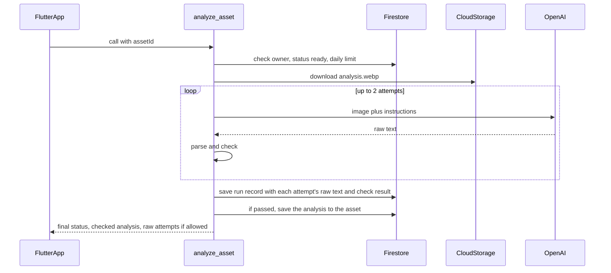

# Phase 2: analyze creative structure, with raw-output inspection

The app sends a reference slide that Phase 1 has already processed. The
backend shows the analysis copy to an OpenAI vision model and asks it to
describe what the slide is doing, in JSON. It then checks that answer against a
fixed structure and a set of app rules. You see three things side by side:

- the model's raw, unchecked answer
- the check result (passed or failed), with the reasons
- the analysis that passed the check, if any

This phase only describes the slide. Deciding what must stay the same is
Phase 3 (the blueprint), and nothing here generates images. The phases are
described in [`v1-backend-plan.md`](v1-backend-plan.md).

## Build checklist

- [x] Rules: inspection exception added to the AI output rule in
      `.cursor/rules/justpost-non-negotiables.mdc`
- [x] Schema and checks: `functions/justpost/analysis_schema.py` and
      `functions/justpost/analysis.py` with `test_analysis.py`
- [x] OpenAI client: `functions/justpost/openai_client.py` with
      `test_openai_client.py`; `openai` and `pydantic` in `requirements.txt`
- [x] Function: the `analyze_asset` callable in `functions/main.py` with tests
      in `test_main.py`
- [x] Firestore rules: owner can read `analysisRuns`; `usage` is server-only
      (deployed)
- [x] App: `build_flags.dart`, `analysis_service.dart`,
      `analysis_result_view.dart`, and the Analyze button on the reference
      screen, with `analysis_service_test.dart`
- [ ] Set the `OPENAI_API_KEY` secret and deploy the functions
- [ ] Simulator and TestFlight checks

## Conflict to flag, and how it is resolved

The rules say "Never return a generated result that hasn't passed validation."
Seeing unchecked output conflicts with that, so it is shown only in debug and
TestFlight builds:

- **Raw output is an inspection record, not a result.** It's stored in
  `assets/{id}/analysisRuns/{runId}`, labelled "Unchecked", and nothing
  downstream reads it.
- **Only a checked analysis counts.** Only an answer that passes is written to
  `assets/{id}.analysis`, the field Phase 3 will read. If both attempts fail,
  the asset is marked `analysisStatus: failed` and `analysis` is cleared.
- **Two switches control who can see raw output:**
  - The server setting `EXPOSE_RAW_ANALYSIS` (on by default during testing)
    controls whether raw text is included in the reply. Turn it off before an
    App Store release.
  - The app flag `showAiInspection` shows the panel only in debug builds, or in
    builds made with `--dart-define=JUSTPOST_INSPECT=true`.

## Flow

## Backend: `functions/`

- **`justpost/analysis_schema.py`:** Pydantic models for the analysis, based on
  the V1 doc's example. Unknown fields are rejected, strings and lists have
  length limits, and every `region` is fractional 0–1 (`x`, `y`, `w`, `h`) and
  must sit inside the slide.
- **`justpost/analysis.py`:** pure functions, no Firebase or OpenAI code.
  - `INSTRUCTIONS` / `build_instructions()`: the observation-only prompt with
    the expected JSON shape (loose mode, no forced structure). A retry
    includes the previous attempt's failures.
  - `parse_raw(text)`: accepts plain JSON or JSON in one code fence; anything
    else fails.
  - `check_analysis(data, expected_orientation)`: the schema, regions inside
    the frame, no prescriptive rules ("must", "should", "preserve", "may vary"
    and similar) outside the slide's own visible text, and an orientation that
    matches the ingested slide.
  - `analyze(image, model)`: up to two attempts; returns every attempt (raw
    text, check result, model, time, token counts) plus the analysis that
    passed, if any.
- **`justpost/openai_client.py`:** the OpenAI Responses API with the WebP sent
  inline as base64, `store=False`, a 50-second timeout and no SDK retries.
  Errors become `ModelError` with only the error type.
- **`main.py`, `analyze_asset`:** us-central1, App Check enforced, at most 3
  instances, 120-second timeout, `OPENAI_API_KEY` attached as a secret.
  - Checks: signed in, well-formed asset ID, the asset belongs to the caller
    (otherwise "not found"), and `status == ready`.
  - 20 analyses per user per UTC day, counted in `usage/{uid}` with a
    Firestore transaction before any model call.
  - Re-runs are allowed so you can compare answers; each one adds a run record.
- **Settings:** `ANALYSIS_MODEL` (default `gpt-5.4-mini`) and
  `EXPOSE_RAW_ANALYSIS` live in `functions/.env`, which is gitignored.

## Flutter app

- **`lib/config/build_flags.dart`:** `showAiInspection`.
- **`lib/features/create/analysis_service.dart`:** calls `analyze_asset` and
  returns an `AnalysisRun` (attempts, checked analysis, whether raw text was
  sent).
- **`lib/features/create/analysis_result_view.dart`:** the check status card,
  the checked analysis card, and the "Unchecked raw output" panel with a copy
  button per attempt.
- **`lib/features/create/reference_ready_screen.dart`:** the "Analyze slide"
  button and the result view.

## Console steps

- [ ] Create an OpenAI API key for JustPost and set a monthly spending limit
      in the OpenAI dashboard.
- [ ] Run `firebase functions:secrets:set OPENAI_API_KEY` and paste the key.
- [ ] Add the Firebase budget alerts at $5 and $10 (open from Phase 1).
- [ ] Add the simulator's App Check debug token (open from Phase 1).
- [ ] Before an App Store release, set `EXPOSE_RAW_ANALYSIS=false` and build
      without `JUSTPOST_INSPECT`.

## Verification

1. Run `pytest` in `functions/`, and the Dart analyzer plus `flutter test` for
   the app.
2. Deploy with `firebase deploy --only functions,firestore`.
3. On the simulator, run a slide through "Use as reference", then "Analyze
   slide". Compare the raw panel with the check result and the checked
   analysis.
4. Build for TestFlight with
   `flutter build ipa --release --build-number=<next> --dart-define=JUSTPOST_INSPECT=true`,
   then try a few of your best-performing slides.
