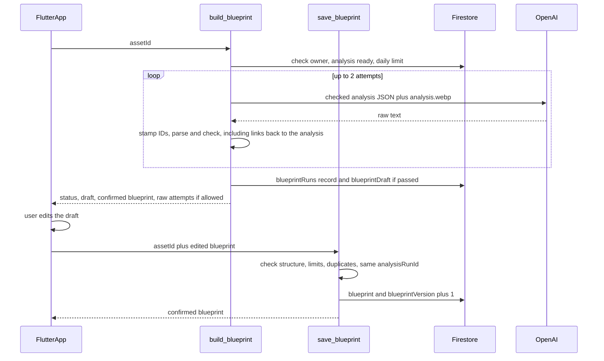

# Phase 3: build the creative blueprint, editable before use

From the checked Phase 2 analysis and the slide image, the AI proposes a
**draft blueprint**: the slide's "creative DNA". You see the raw output and the
check result, as in Phase 2, and you can edit the draft on the Blueprint
screen. Saving sends your version to the server, which checks it again and
stores it as the **confirmed blueprint**. Only the confirmed blueprint will
feed Phase 4 (variation plans). Nothing here generates images. The phases are
described in [`v1-backend-plan.md`](v1-backend-plan.md).

## Build checklist

- [x] Shared model plumbing: `functions/justpost/model_io.py` (`run_attempts`,
      `parse_raw`, `Attempt`, `CheckReport`); `VisionModel.respond(instructions,
      user_text, image_webp)`
- [x] Blueprint core: `functions/justpost/blueprint_schema.py` and
      `functions/justpost/blueprint.py` with `test_blueprint.py`
- [x] Functions: `build_blueprint` and `save_blueprint` in `functions/main.py`,
      plus a per-kind daily limit, with tests in `test_main.py` (deployed)
- [x] Firestore rules: owner can read `blueprintRuns` (deployed)
- [x] App: `model_run_widgets.dart`, `blueprint_service.dart`,
      `blueprint_editor.dart`, `blueprint_screen.dart`, and the Build blueprint
      button, with `blueprint_editor_test.dart` and
      `blueprint_service_test.dart`
- [ ] Simulator and TestFlight checks

## Conflicts flagged, and how they are resolved

- **The V1 doc calls the blueprint "canonical" and stable, but it is
  editable.** The asset keeps two separate things: `blueprintDraft`, the AI's
  checked proposal, and `blueprint`, the version you saved, with
  `blueprintVersion`. The canonical blueprint is the confirmed one; rebuilding
  a draft never overwrites it.
- **Edits are user input, not AI output, but are still checked on the
  server**, because the app can't be trusted to send valid data. Edits get
  looser minimums than the AI.
- **Re-running Phase 2 replaces the analysis.** Every draft and confirmed
  blueprint records its `analysisRunId`. `save_blueprint` rejects a draft built
  from an older analysis ("Rebuild the draft"). A confirmed blueprint stays
  usable, and the screen notes when it came from an earlier analysis.
- **Code, not the model, owns item IDs, `origin` and `analysisRunId`.** The
  model's reply is stamped with them before it's checked, so it can't claim an
  item came from the user or belongs to another analysis.

## Flow

## Blueprint shape (`schemaVersion: 1`)

- `creativeFamily`, `objective`, `analysisRunId`.
- `requiredPrinciples` (must keep), `preferredPrinciples` (nice to keep) and
  `forbiddenDrift` (never): items with `id`, `text`, `basis` (analysis paths
  such as `subjects.0.faceVisibility`) and `origin` (`ai` or `user`).
- `variationDimensions` (can vary): items with `id`, `name`, up to 5
  `examples`, `basis` and `origin`.
- `copyStrategy`: `role` (a role used on the slide, or `none`),
  `primaryPattern`, optional `secondaryPattern`.

| Section | AI draft | Your edits |
| --- | --- | --- |
| Must keep | 3–10 | 1–10 |
| Nice to keep | 0–8 | 0–8 |
| Can vary | 3–12 | 1–12 |
| Never | 2–8 | 0–8 |

## Checks (`check_blueprint`)

- The schema and the size limits for the source (AI or user).
- Every `basis` path exists in the checked analysis. AI items must cite at
  least one; items you add may have none.
- No duplicate or near-duplicate text across all sections (word overlap of 80%
  or more), so the same idea can't be both "must keep" and "can vary".
- Unique item IDs.
- `copyStrategy.role` is used by one of the analysis's text blocks, or `none`
  when the slide has no text.
- `analysisRunId` matches the slide's current analysis.

## Settings and limits

- `BLUEPRINT_MODEL` (default `gpt-5.4-mini`) in `functions/.env`.
- 20 blueprint builds per user per UTC day, counted separately from the 20
  analyses, in `usage/{uid}`.
- Raw text is included in replies only when `EXPOSE_RAW_ANALYSIS` is on, and
  the raw panel shows only when `showAiInspection` is on.

## Verification

1. Run `pytest` in `functions/`, and the Dart analyzer plus `flutter test`.
2. Deploy with `firebase deploy --only functions,firestore`.
3. Analyze a slide, then tap **Build blueprint**. Compare the raw output with
   the draft, then move an item from "Must keep" to "Can vary", delete an item,
   add one of your own, and save. Save again after another edit and check the
   version goes up.
4. Go back, re-run the analysis, build a blueprint, and confirm the screen
   notes that the confirmed version came from an earlier analysis.
