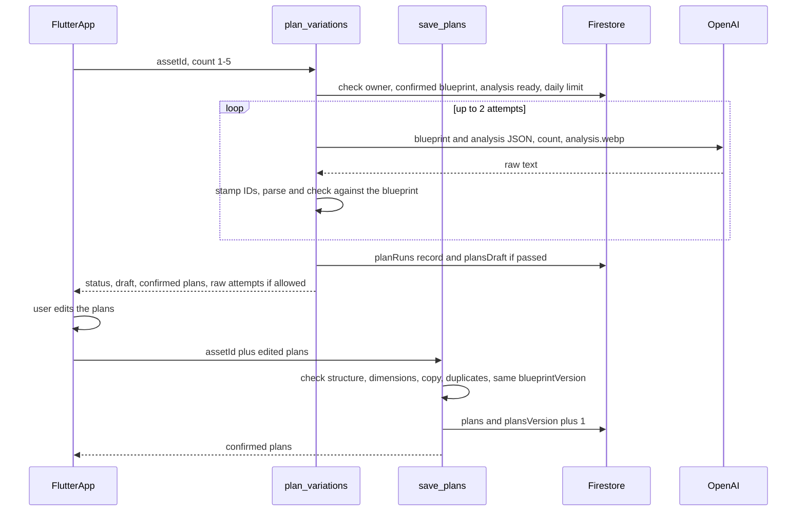

# Phase 4: variation plans, editable before images are made

From the **confirmed blueprint**, the checked analysis and the slide image, the
AI writes 1 to 5 **variation plans** (you pick the number; the default is 1).
Each plan says exactly what changes in that variation, such as "hijab: warm
cream; drink: iced coffee", plus the hook text it will use. As in Phases 2 and
3, you see the raw output next to the check result. You can edit every plan,
and saving sends your version to the server, which checks it again and stores
it as the **confirmed plans**. Only the confirmed plans will feed Phase 5
(images). Nothing here generates images. The phases are described in
[`v1-backend-plan.md`](v1-backend-plan.md).

## Build checklist

- [ ] Plan core: `functions/justpost/plan_schema.py` and
      `functions/justpost/planning.py` with `test_planning.py`
- [ ] Functions: `plan_variations` and `save_plans` in `functions/main.py`,
      with a `plans` daily limit, and tests in `test_main.py`
- [ ] Firestore rules: the owner can read `planRuns`; then deploy
- [ ] App: `plan_service.dart`, `plan_editor.dart`, `plans_screen.dart`, and a
      **Plan variations** button with a 1–5 count picker on the Blueprint
      screen, with `plan_editor_test.dart` and `plan_service_test.dart`
- [ ] Verify, deploy the functions, and tick this checklist

## Decisions

- **Count:** 1 to 5 per run, default 1. The server rejects anything else.
- **Editing:** fully editable, like the blueprint. You can change any value,
  add or remove changes, rewrite the hook text, delete a plan, or add your own
  plan, up to 5 in total.
- **Model input:** the confirmed blueprint, the checked analysis and
  `analysis.webp`. This costs about the same as a blueprint build.
- **Runs are independent.** The model doesn't see earlier plans, so
  "generate more" could repeat an earlier idea. Within one run, plans must
  differ from each other.
- **Variation strength stays internal** and fixed at "medium": each AI plan
  changes 2 to 4 of the blueprint's "can vary" dimensions, never all of them
  at once. It isn't shown in the app.

## Conflicts flagged, and how they are resolved

- **In the V1 doc, `visual_changes` is a free-form object** (`hijab_color`,
  `beverage`, ...). Here every change must name a dimension ID from the
  confirmed blueprint's "can vary" list (`var2`, `u1`, ...). Code can then
  check that a plan only changes what the blueprint allows, as the V1 doc's
  "Vary only dimensions that are allowed by the blueprint" requires. The
  drawback is that the model can't invent a new dimension. You can add one to
  the blueprint and save it first.
- **"Must keep" and "never" can't be fully checked in code.** A plan that
  changes the drink to "a cup with a visible face printed on it" passes every
  structural check. Code catches what it can: a change that closely repeats a
  "never" item (word overlap of 80% or more, as in Phase 3). The rest waits for the Phase 7 validator, which judges the finished
  image. This phase doesn't claim to guarantee it.
- **The plans depend on a specific blueprint version.** Every draft and
  confirmed plan set records `blueprintVersion` and `analysisRunId`.
  `save_plans` rejects a draft built from an older blueprint ("The blueprint
  changed since these plans were written. Plan again."). Confirmed plans stay
  readable, and the screen notes when they came from an earlier blueprint.
  Phase 5 will refuse stale plans.
- **Hook text from a plan will be drawn on the image in Phase 6,** so it is
  stored exactly as checked: trimmed, 1–150 characters, no line breaks, and no
  more than 3 sentences. Your edits go through the same check, because the app
  can't be trusted to send valid data.
- **Code, not the model, owns plan IDs, `origin`, `blueprintVersion` and
  `analysisRunId`.** The reply is stamped before it's checked (`p1`…`p5` for
  the AI, `u1`, `u2`, … for plans you add), so the model can't claim a plan is
  yours or belongs to another blueprint.

## Flow

## Plan shape (`schemaVersion: 1`)

A plan set:

- `schemaVersion`, `analysisRunId`, `blueprintVersion`.
- `plans`: 1–5 plans.

Each plan:

- `id`, `origin` (`ai` or `user`).
- `title`: a short label for the plan, such as "Cozy coffee run", up to 80
  characters.
- `changes`: a list of `{dimensionId, value}`. `value` is the new choice for
  that dimension, up to 120 characters.
- `copy`: `{text, pattern}`, or `null` when the blueprint's copy role is
  `none`. `pattern` names the hook style, such as "POV" or "how-to", and
  should follow the blueprint's `copyStrategy`.

| Rule | AI draft | Your edits |
| --- | --- | --- |
| Plans | exactly the requested count | 1–5 |
| Changes per plan | 2–4 (1 if the blueprint has only 1 dimension) | 1 up to every dimension |

## Checks (`check_plans`)

- The schema and the size limits for the source (AI or user).
- `blueprintVersion` and `analysisRunId` match the slide's confirmed blueprint
  and current analysis.
- Every `dimensionId` is one of the blueprint's "can vary" dimensions, and no
  plan changes the same dimension twice.
- No change closely repeats a "never" item.
- `copy` is present when the blueprint has a copy role and `null` when the
  role is `none`. The text follows the 150-character rule above.
- Plans aren't near-duplicates of each other. The check compares the changes,
  as dimension and value pairs, plus the hook text, using the same 80% word
  overlap. Two plans that differ only in one word of the hook count as
  duplicates.
- Unique plan IDs.

## App

- **Blueprint screen:** a **Plan variations** button with a 1–5 picker under
  the confirmed blueprint. It's disabled while the blueprint has unsaved edits
  or there's no confirmed version.
- **Plans screen**, built like the Blueprint screen with `CheckStatusCard`,
  `RawOutputPanel` and `AppCard`:
  - one card per plan, showing the title, its change rows and the hook text;
  - each change row has a dimension picker, limited to the blueprint's "can
    vary" dimensions, and a value field;
  - add and remove changes, delete a plan, and **Add plan** (up to 5);
  - **Save plans**, plus **Plan again**, which asks before discarding unsaved
    edits;
  - a note when the confirmed plans came from an earlier blueprint version.
- `PlanEditor` is immutable like `BlueprintEditor`, with `isEdited`,
  `isDirty`, `canSave` and `problems`. It mirrors the server's limits so you
  see problems before saving; the server still decides.

## Settings and limits

- `PLAN_MODEL` (default `gpt-5.4-mini`) in `functions/.env`.
- 20 plan runs per user per UTC day in `usage/{uid}`, counted separately from
  analyses and blueprints. Each run can make two paid requests, whatever the
  count.
- Raw text is included in replies only when `EXPOSE_RAW_ANALYSIS` is on, and
  the raw panel shows only when `showAiInspection` is on.

## Verification

1. Run `pytest` in `functions/`, and the Dart analyzer plus `flutter test`.
2. Deploy with `firebase deploy --only functions,firestore`.
3. Open a slide with a confirmed blueprint, pick 3 and tap **Plan
   variations**. Compare the raw output with the checked plans and confirm the
   three differ.
4. Edit a value, switch a change to another dimension, rewrite a hook, delete
   one plan, add your own, and save. Save again after another edit and check
   that the version goes up.
5. Edit and save the blueprint, then go back to the plans and confirm the
   screen notes that they came from an earlier blueprint, and that saving the
   old draft is refused.
