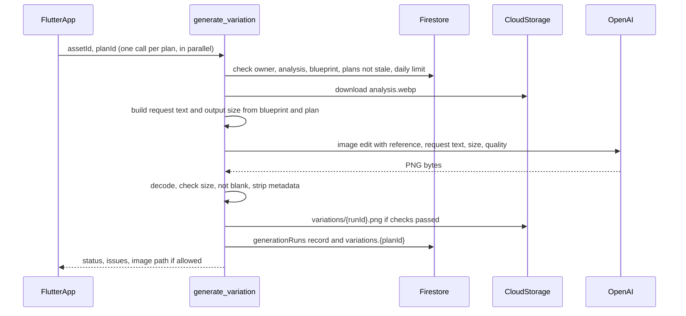

# Phase 5: create one image per confirmed plan

From the **confirmed plans**, the confirmed blueprint and the slide image,
JustPost asks an image model for one new picture per plan. Code, not a model,
writes each request from the blueprint's "must keep" and "never" items and the
plan's changes. Each image passes basic checks in code (it decodes, it has the
size that was asked for, it isn't blank) and is stored as an **unchecked
variation**. Nothing is drawn on the image yet: the hook text is drawn in
Phase 6, and whether the image follows the blueprint is judged in Phase 7.
Until then these images are for inspection only. The phases are described in
[`v1-backend-plan.md`](v1-backend-plan.md).

## Build checklist

- [x] Generation core: `functions/justpost/generation.py` (request text, output
      size, staleness check, image checks) with `test_generation.py`
- [x] Image model client: `ImageModel` in `functions/justpost/model_io.py` and
      `OpenAIImageModel` in `functions/justpost/openai_image.py`, with
      `test_openai_image.py`
- [x] Function: `generate_variation` in `functions/main.py`, with an `images`
      daily limit, and tests in `test_main.py`
- [x] Rules: the owner can read `generationRuns` (Firestore) and
      `uploads/{uid}/{assetId}/variations/*` (Storage); only the server writes
- [x] App: `generation_service.dart`, `variations_screen.dart`, and a
      **Create images** button on the Plans screen, with
      `generation_service_test.dart`
- [x] Verify: `pytest`, the Dart analyzer and `flutter test` pass
- [ ] Budget alerts, then deploy with
      `firebase deploy --only functions,firestore,storage`
- [ ] Simulator and TestFlight checks

## Decisions

- **One image per plan per tap.** The app calls `generate_variation` once per
  confirmed plan, all at the same time (up to 5). Each call makes one paid
  image request. A failure affects only that plan's card, and the server can't
  run out of time on a whole batch.
- **No automatic retries.** A failed image shows its reason and a **Try again**
  button, which counts against the daily limit again. Automatic retries belong
  to Phase 8, which is optional.
- **Model:** `IMAGE_MODEL`, default `gpt-image-2`, using the image edit
  endpoint with the slide as the reference image. `IMAGE_QUALITY`, default
  `medium`. Both live in `functions/.env`, so you can compare models and
  quality levels without changing code.
- **Reference input:** `analysis.webp` (upright, sRGB, longest side 1536 px),
  the same copy Phases 2 to 4 used. The output is no bigger than 1536 px, so
  sending the full-resolution working copy wouldn't add detail. It would only
  make the upload slower.
- **Output size follows the slide's shape.** `gpt-image-2` accepts any
  `WIDTHxHEIGHT` with both sides divisible by 16 and an aspect ratio between
  1:3 and 3:1. Code sets the longest side to 1536 px and rounds both sides to
  multiples of 16. A 1179×2556 slide becomes 704×1536. Slides outside the 1:3
  to 3:1 range are clamped to it.
- **The hook text is not sent to the image model.** The request says "no text,
  captions or lettering", and Phase 6 draws the plan's hook text exactly as it
  was checked.
- **Each new image replaces the plan's previous one in the app,** but every
  image and its run record are kept in Storage and Firestore for comparison.

## Conflicts flagged, and how they are resolved

- **The rules say never return a generated result that hasn't passed
  validation, but the blueprint check is Phase 7.** In this phase the code
  checks only what it can verify itself: the file decodes, it's a PNG, it has
  the requested size, and it isn't blank or a single color. Everything the
  blueprint asks for (face still hidden, no text, still in a car, and so on)
  waits for the Phase 7 validator. To stay within the rule:
  - images are stored with status `unchecked`, never `ready` or `final`;
  - the server sends their location to the app only when
    `EXPOSE_RAW_ANALYSIS` is on, the same switch that already controls showing
    unchecked model output;
  - the Variations screen exists only when `showAiInspection` is on (debug and
    TestFlight builds). It labels every image **Not checked yet** and has no
    save, share or export action.

  App Store builds therefore can't reach these images until Phase 7 marks
  them as passed.
- **The V1 doc's example request is free text written for each variation.**
  Here the request is built by code from checked data only: the confirmed
  blueprint's items, and each plan change written as the dimension's name
  plus its new value. No model writes or edits the request, so model output
  can't add instructions to it.
- **"Must keep" and "never" can't be enforced on pixels in code.** They go into
  the request as instructions, and the image model may still ignore them.
  Phase 7 decides whether it did. This phase doesn't claim otherwise.
- **The output shape differs slightly from the slide** (704×1536 against
  1179×2556 is about 0.6% narrower) because of the 16-pixel rounding. Each run
  records the image's real width and height. Phase 6 positions text with
  fractional 0–1 coordinates measured against the generated image, so this
  small difference doesn't move the text.
- **Plans can go out of date.** `generate_variation` refuses plans whose
  `blueprintVersion` or `analysisRunId` no longer match the slide ("The
  blueprint changed since these plans were saved. Plan again."). Each run
  records `plansVersion`, and the app's **Create images** button is disabled
  for plans from an earlier blueprint.
- **The image model can refuse a request for content-safety reasons.** The run
  is recorded as `failed` with "The image model declined this plan." The
  provider's error details aren't shown or logged.

## Flow

## Request text

`generation.build_request(blueprint, plan)` returns plain text in this order:

1. "Use the reference image for style, camera angle, lighting and realism. Make
   a new image; don't copy it pixel for pixel."
2. **Keep:** every "must keep" item, then "nice to keep" items marked as
   preferred.
3. **For this variation:** each change, written as
   `{dimension name}: {value}`.
4. **Never:** every "never" item.
5. "No text, captions, lettering or logos anywhere in the image. Where the
   reference has text, continue the scene instead."

It contains only the slide's own checked data. A test checks that the hook
text never appears in it.

## Records

`assets/{assetId}/generationRuns/{runId}`:

- `uid`, `planId`, `plansVersion`, `blueprintVersion`, `analysisRunId`
- `model`, `quality`, `size`, `request` (the exact request text)
- `status`: `unchecked` (passed the code checks) or `failed`
- `issues`, `latencyMs`, `inputTokens`, `outputTokens`
- `imagePath`, `width`, `height` (only for `unchecked`), `createdAt`

On the asset, `variations.{planId}` holds the latest run's `runId`, `status`,
`imagePath`, `width`, `height` and `plansVersion`.

Storage: `uploads/{uid}/{assetId}/variations/{runId}.png`, written only by the
server, readable by the owner, with no EXIF or other metadata.

## Checks (`check_image`)

- Pillow opens it, with the same pixel-count limit as ingest, and it is a PNG.
- Width and height equal the requested size.
- It isn't blank: the spread of pixel values is above a small threshold, which
  catches all-black and single-color images.
- It's re-saved as PNG without metadata before upload.

Anything the blueprint or plan asks for is Phase 7's job.

## App

- **Plans screen:** a **Create images** button under the confirmed plans. It's
  disabled while the plans have unsaved edits, when nothing is confirmed, or
  when the confirmed plans came from an earlier blueprint. It's shown only
  when `showAiInspection` is on.
- **Variations screen,** built from `AppCard` and `CheckStatusCard` like the
  other screens:
  - the reference slide at the top for comparison;
  - one card per confirmed plan, with its title and changes, a status (waiting,
    creating, not checked yet, failed), and the image when it's ready;
  - the plan's hook text as plain text under the image. It isn't drawn on the
    image until Phase 6;
  - **Try again** on failed cards;
  - a **Not checked yet** label on every image, and no save, share or export.
  - The screen starts fresh each time it opens and doesn't load earlier
    images. Those stay in Storage and `generationRuns` for comparison.
- `GenerationService` calls `generate_variation` with a 300-second timeout
  and loads images through `getDownloadURL`, like `asset_service.dart`.
  Errors become plain messages in the same way as `BlueprintService`.

## Settings and limits

- `IMAGE_MODEL` (default `gpt-image-2`) and `IMAGE_QUALITY` (default `medium`)
  in `functions/.env`.
- `generate_variation`: 1 GB memory, 1 CPU, 300-second timeout, concurrency 1,
  at most 5 instances so that 5 plans can run at the same time.
- 10 images per user per UTC day in `usage/{uid}`, counted separately from
  analyses, blueprints and plans. Images cost much more than text requests, so
  check current OpenAI pricing for the chosen model and quality before raising
  the limit. The $5 and $10 budget alerts from Phase 1 should be set up
  before this deploy.
- Image locations are returned only when `EXPOSE_RAW_ANALYSIS` is on.

## Verification

1. Run `pytest` in `functions/`, and the Dart analyzer plus `flutter test`.
2. Deploy with `firebase deploy --only functions,firestore,storage`.
3. On a slide with confirmed plans, tap **Create images** with 3 plans. Check
   that each card fills in on its own, the images match the slide's shape,
   and Storage has one PNG per plan.
4. Compare each image with its plan: are the changes visible, is everything
   in "must keep" still there, and is the image free of text? Note the
   failures. They're the cases Phase 7 has to catch.
5. Tap **Try again** on one card and check that a new run is recorded and the
   card shows the new image.
6. Edit and save the blueprint, then confirm that **Create images** is
   disabled and that calling with the old plans is refused.
7. Use up the daily limit and check the limit message.
