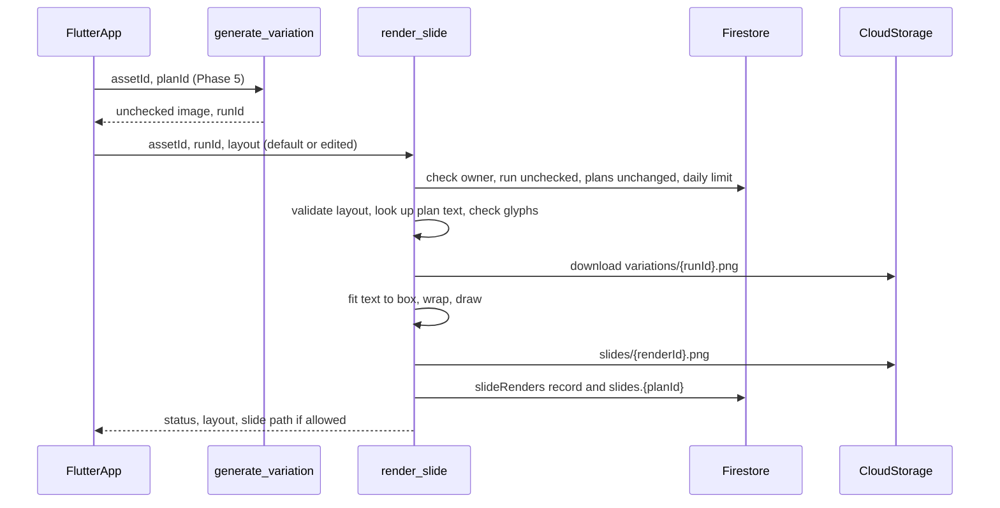

# Phase 6: draw the slide text on each image, in code

Each Phase 5 image gets its plan's hook text drawn on it by code, never by a
model, so the wording, spelling and line breaks are exactly what was checked
in Phase 4. Where the text goes comes from the reference slide: the checked
analysis already records each text block's role and its position as a
fractional box. You can switch the text style and move it between a few
positions. Every change is drawn again by the server, so what you see in the
app is the exact file that will be exported. The result is a **slide**, still
unchecked until Phase 7. The phases are described in
[`v1-backend-plan.md`](v1-backend-plan.md).

## Build checklist

- [x] Font: an OFL-licensed font (Inter, Bold and ExtraBold) with its license in
      `functions/justpost/fonts/`; `fonttools` in `requirements.txt`
- [x] Layout and drawing: `functions/justpost/layout_schema.py` and
      `functions/justpost/render.py` with `test_render.py`
- [x] Function: `render_slide` in `functions/main.py`, with a `renders` daily
      limit, and tests in `test_main.py`
- [x] Rules: the owner can read `slideRenders` (Firestore) and
      `uploads/{uid}/{assetId}/slides/*` (Storage); only the server writes
- [x] App: `render_service.dart`, text controls on each Variations card, with
      `render_service_test.dart`
- [x] Verify (217 backend tests, 64 app tests, analyzer clean) and tick this checklist
- [ ] Deploy: `firebase deploy --only functions,firestore,storage`
- [ ] Simulator and TestFlight checks

## Decisions

- **The server draws, and the app only shows the server's file.** Preview and
  export are the same PNG, made by one renderer (Pillow) from one layout
  record, as the rules require. The cost is that you can't drag text live:
  each change is a round trip of about a second. No model is called, so a
  re-draw costs only a little server time.
- **The text comes from the confirmed plan, never from the app.** The app sends
  only the layout (style, position, alignment); the server looks up the text
  from the plan that the image was made from. The text isn't edited on this
  screen. To change it, edit the plan and create the image again.
- **One text layer per slide.** A plan has one hook text, so a slide gets one
  text block, even if the reference had several (for example a hook plus a
  subtitle).
- **Three fixed styles,** defaulting to the first:
  - `outlined`: white text with a black outline, the common TikTok look;
  - `white_box`: dark text on a white rounded box;
  - `dark_box`: white text on a dark, slightly see-through rounded box.
- **Positions:** `reference` (the default; where the reference slide's text
  was), plus `top`, `middle` and `bottom` presets. Each is a fixed fractional
  box.
- **The text is drawn automatically** when an image is created, using the
  default layout. Changing the style or position draws it again.
- **The output is the same size as the generated image** (for example
  704×1536). Because the layout is fractional, drawing it bigger later doesn't
  change the composition.

## Conflicts flagged, and how they are resolved

- **The analysis doesn't record the text style** (font, color, outline or box).
  It records where the text was, but not what it looked like. Rather than
  adding a field and re-analyzing every slide, this phase uses the three fixed
  styles and lets you pick. Recording the style in the analysis
  (`schemaVersion: 2`) can come later, once there's a reason to pick the style
  automatically.
- **The reference text box may not suit the new image.** The image model can
  move the subject, so the text can end up over a face or a key object. Code
  can't see that. The `top`, `middle` and `bottom` presets let you move it,
  and Phase 7 is where it gets judged automatically.
- **Non-Latin text.** Pillow's basic text layout can't join and order Arabic
  script, and the font doesn't contain emoji. Before drawing, the server checks
  that the font has a glyph for every character. If it doesn't, the slide fails
  with "The font can't draw these characters: …" rather than drawing empty
  boxes. Given what JustPost is for, Arabic support (through Pillow's Raqm
  layout plus an Arabic font) is likely needed soon. It's left out of this
  phase on purpose and listed under follow-ups.
- **The image itself may contain text** despite the Phase 5 request. Drawing on
  top of it could look messy, but code can't detect that. It's left to Phase 7.
- **Layouts from the app are untrusted.** `render_slide` validates them against
  the schema: known style, position and alignment values and nothing else. It
  never takes a box, text, sizes or pixel values from the app.

## Flow



## Layout shape (`schemaVersion: 1`)

```json
{
  "schemaVersion": 1,
  "style": "outlined",
  "position": "reference",
  "box": {"x": 0.08, "y": 0.62, "w": 0.84, "h": 0.18},
  "align": "center"
}
```

- `box` uses the analysis's `Region` model: fractions of the canvas, measured
  from the top-left, inside the frame.
- The app sends only `style`, `position` and `align` (the `LayoutChoice`
  model, which rejects any other field). The server always works out `box`
  itself, for presets and `reference` alike, so the app can't send a box.
- For `reference`, the box is the analysis copy block whose role matches the
  blueprint's `copyStrategy.role`, or the first copy block if none matches,
  grown around its center to at least 60% of the width and 18% of the height
  (and kept inside the frame). If the analysis has no text at all, `bottom` is
  used.
- Every size in the drawing is a fraction of the canvas: font size, outline
  width, box padding and corner radius. The record keeps the pixel values it
  used, but only for inspection.

## Drawing (`render.py`)

- **Fit:** the largest font size, between 2.5% and 6% of the canvas height,
  whose word-wrapped text fits in the box. The text gets at most 6 lines, and
  lines break only between words. If it doesn't fit at the smallest size, the
  slide fails with "The text doesn't fit in this position", and you can try
  another position.
- **Order:** the box background (for box styles), then the outline, then the
  text, each anti-aliased, onto an RGB copy of the image. The original image
  file isn't changed.
- **Output:** a PNG with no metadata at
  `uploads/{uid}/{assetId}/slides/{renderId}.png`.
- **Plans without text** (copy role `none`): the slide is the image itself,
  copied as is, and the text controls are hidden.

## Records

`assets/{assetId}/slideRenders/{renderId}`:

- `uid`, `generationRunId`, `planId`, `plansVersion`
- `layout` (as checked), `text`, `fontSizePx`, `lines`, `width`, `height`
- `status`: `rendered` or `failed`, `issues`, `imagePath`, `createdAt`

On the asset, `slides.{planId}` holds the latest render's `renderId`,
`status`, `imagePath`, `layout` and `generationRunId`.

## Checks before drawing

- The generation run belongs to this asset and owner, its status is
  `unchecked`, and its file exists.
- The run's `plansVersion` equals the slide's current `plansVersion`. If not:
  "The plans changed since this image was made. Create the images again."
- The plan is still in the confirmed plans, and its text passes the Phase 4
  rules again: one line, 150 characters at most, and at most 3 sentences.
- The font has a glyph for every character.

## App

- On each Variations card, once the image is created, the app calls
  `render_slide` with the default layout and shows the slide in place of the
  plain image, with a **Show without text** toggle.
- Under the slide:
  - a **Style** segmented control (Outlined, White box, Dark box);
  - a **Position** menu (As in reference, Top, Middle, Bottom).
  Each change draws the slide again, keeping the previous one on screen until
  the new one arrives.
- Failures such as "The text doesn't fit" show on the card and keep the last
  good slide.
- The **Not checked yet** label stays, with no save, share or export, and it's
  still shown only in inspection builds.

## Settings and limits

- `render_slide`: 512 MB memory, 1 CPU, 30-second timeout, at most 5
  instances.
- 200 renders per user per UTC day in `usage/{uid}`, counted separately. A
  render is cheap, but the limit stops a broken client from looping.
- Slide locations are returned only when `EXPOSE_RAW_ANALYSIS` is on.

## Verification

1. Run `pytest` in `functions/`, and the Dart analyzer plus `flutter test`.
   `test_render.py` covers:
   - drawing the same layout on 704×1536 and 1408×3072 canvases gives font
     sizes and text boxes in proportion;
   - text stays inside its box;
   - text that is too long fails;
   - an emoji or Arabic text fails the glyph check;
   - presets ignore a `box` sent by the app;
   - text from the app is ignored.
2. Deploy with `firebase deploy --only functions,firestore,storage`.
3. Create images for 3 plans, and check that each slide's text matches its plan
   exactly and sits where the reference's text was.
4. Switch styles and positions on one card, and check that each change
   arrives in about a second and that the Storage file matches the screen.
5. Edit and save the plans, then check that drawing on an older image is
   refused.

## Follow-ups (not in this phase)

- Arabic and other complex scripts (Raqm layout plus an Arabic font) and emoji.
- Recording the text style in the analysis, so the style can match the
  reference automatically.
- Free dragging and resizing in the app, rendered on the device from the same
  layout record, once an on-device renderer can be shown to match the server's
  output.
- A second text layer for references with a hook and a subtitle.
