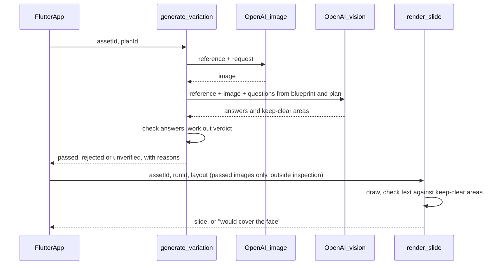

# Phase 7: check each image against the blueprint and its plan

Right after an image is created, a vision model compares it with the reference
slide, the confirmed blueprint and the plan it was made from. It answers one
question per blueprint and plan item, and code decides from those answers
whether the image passes. Only images that pass become usable slides: they lose
the **Not checked yet** label and can be shown in every build, not just
inspection builds. The same check also marks the areas the slide text must not
cover (faces, the product), and code keeps the drawn text out of them, so
changing the style or position never needs another model call. Retrying failed
images automatically is Phase 8. The phases are described in
[`v1-backend-plan.md`](v1-backend-plan.md).

## Build checklist

- [x] Model plumbing: the vision model and `run_attempts` accept a second image
      (the reference), with tests
- [x] Check shape and verdict: `functions/justpost/validation_schema.py` and
      `functions/justpost/validation.py` with `test_validation.py`
- [x] Text placement: keep-clear overlap check and automatic position fallback
      in `render.py`, with tests in `test_render.py`
- [x] Functions: `generate_variation` checks every image before replying;
      `render_slide` accepts only passed images outside inspection; tests in
      `test_main.py`
- [x] App: check results on each Variations card, the Images section opened to
      all builds, and tests
- [x] Verify (253 backend tests, 67 app tests, analyzer clean) and tick this checklist
- [ ] Deploy: `firebase deploy --only functions,firestore,storage`
- [ ] Simulator and TestFlight checks with real slides, including at least one
      image that should fail

## Decisions

- **The check runs inside `generate_variation`.** The image is never returned
  to the app before it's checked, which is what the rules require. It adds
  about 10–20 seconds to each image. There's no separate "check" button.
- **The model answers questions; code gives the verdict.** The model returns
  one answer per item, each `yes`, `no` or `unsure`, with a short note. Code
  checks that every item was answered exactly once, then works out the verdict.
  The model's own opinion of the image is never asked for or used.
- **What's checked, and what decides the verdict:**

  | Question | Source | Fails the image when |
  |---|---|---|
  | Is each required principle still true? | blueprint `requiredPrinciples` | `no` or `unsure` |
  | Is each forbidden drift present? | blueprint `forbiddenDrift` | `yes` or `unsure` |
  | Was each planned change made? | plan `changes` | `no` or `unsure` |
  | Is there any visible text or lettering in the image? | fixed | `yes` or `unsure` |
  | Are there major artifacts (warped hands or faces, melted objects, broken edges)? | fixed | `yes` or `unsure` |
  | Is each preferred principle still true? | blueprint `preferredPrinciples` | never; shown for information only |

  `unsure` counts as a failure, because the rules say uncertain results are
  dropped, not shipped.
- **The check looks at the plain image, not the slide.** The slide text is
  drawn by code from the checked plan, so its wording is already exact. What
  code can't know is where the subject ended up. So the check also returns up
  to 6 **keep-clear areas** (faces, the product, anything the slide depends
  on), as fractional boxes. `render_slide` checks the drawn text's box against
  them. Restyling and moving text never calls a model.
- **The default position avoids the subject.** The first render tries the
  reference position, then `bottom`, `top` and `middle`, and uses the first
  that doesn't cover a keep-clear area. If you pick a position that would
  cover one, the server refuses with "The text would cover the {label}. Try
  another position." and keeps the last slide.
- **Two images go to the model:** the reference slide (`analysis.webp`) and
  the new image, labelled in the request. The reference lets it judge "same
  creative family" and format drift, not just the written blueprint.
- **A passed image is usable everywhere.** The Images section on the Plans
  screen is shown in all builds. Passed slides are shown with a **Passed
  checks** label. Rejected and unverified images are shown only in inspection
  builds; other builds see the reasons and a **Try again** button.
- **The model is configurable:** `VALIDATION_MODEL`, defaulting to
  `gpt-5.4-mini` like the other steps. Judging may need a stronger model; the
  real-slide checks below decide.

## Conflicts flagged, and how they are resolved

- **The backend plan's example returns scores** (`quality_score`,
  `blueprint_match_score`). Model scores aren't calibrated, so a threshold on
  them would be a guess. This phase uses only yes/no answers. Scores can come
  back in Phase 9 to rank passing slides, never to decide pass or fail.
- **The judge is a model too.** Its answers are untrusted output: they're
  schema-checked, every item must be answered, and `unsure` fails. It can still
  pass a bad image or fail a good one. That's accepted for now and measured in
  the real-slide checks. The answers never touch permissions, limits or cost.
- **A paid image can end up unverified.** If the check fails twice (no reply,
  bad JSON, missing items), the image is stored as `unverified` and not shown
  outside inspection, even though it was paid for. **Try again** makes a new
  image. A cheaper "check again" for unverified images is a follow-up.
- **Keep-clear boxes are approximate.** The overlap rule allows a small
  overlap (10% of the keep-clear area) so a loose box doesn't block every
  position. The number is a starting point to tune with real slides.
- **Phase 5 images have no check.** Existing `unchecked` records are treated
  like `unverified`: they stay visible only in inspection builds. They aren't
  checked after the fact.
- **No automatic retry.** A rejected image stays rejected until you tap **Try
  again**, which uses another of the 10 daily image slots. Corrective retries
  ("the face was visible, fix that") are Phase 8.
- **The generation call gets longer.** The image request can take up to 240
  seconds and the check up to 2 × 50 seconds, so `generate_variation`'s timeout
  goes from 300 to 360 seconds, and the app's from 320 to 380.

## Flow



## Check reply shape (`schemaVersion: 1`)

```json
{
  "schemaVersion": 1,
  "checks": [
    {"id": "required:car_interior", "answer": "yes", "note": "Driver's seat, dashboard visible."},
    {"id": "forbidden:studio_lighting", "answer": "no", "note": "Daylight through the windshield."},
    {"id": "change:0", "answer": "yes", "note": "The hijab is now emerald green."},
    {"id": "text_in_image", "answer": "no", "note": "No lettering anywhere."},
    {"id": "artifacts", "answer": "no", "note": "Hands and cup look natural."},
    {"id": "preferred:handheld_angle", "answer": "unsure", "note": "Angle is level."}
  ],
  "keepClear": [
    {"label": "face", "region": {"x": 0.3, "y": 0.18, "w": 0.32, "h": 0.2}},
    {"label": "drink", "region": {"x": 0.52, "y": 0.5, "w": 0.18, "h": 0.2}}
  ]
}
```

- Check ids are built by the server and listed in the request:
  `required:{id}`, `preferred:{id}`, `forbidden:{id}`, `change:{n}` (counting from 1),
  `text_in_image`, `artifacts`. The reply must contain each exactly once and
  nothing else. Missing, extra or repeated ids fail the attempt, and the second
  attempt is told which ones.
- `answer` is `yes`, `no` or `unsure`; `note` is at most 200 characters.
- `keepClear` holds at most 6 areas, each with a label of at most 40
  characters and the analysis's `Region` model (fractions, inside the frame).
  It may be empty.

## Records

`assets/{assetId}/generationRuns/{runId}` gains:

- `status`: `passed`, `rejected` or `unverified` (plus `failed` when the image
  itself wasn't made, as in Phase 5)
- `validation`: `model`, `checks` (as checked, each with its question text),
  `failedChecks` (the ids that decided a rejection), `keepClear`, `attempts`
  (raw replies, for inspection only), `latencyMs`, `inputTokens`,
  `outputTokens`

On the asset, `variations.{planId}.status` carries the new status.
`slideRenders` records gain `keptClear: true` and the keep-clear areas they
were checked against.

## Settings and limits

- `generate_variation`: timeout 360 seconds; everything else as in Phase 5.
- No new daily limit: there's exactly one check per image, so the 10 images a
  day already cap it.
- Cost: one extra `gpt-5.4-mini` call with two images per variation, small
  next to the image itself.
- The image path is returned for `passed` images in every build, and for
  `rejected` and `unverified` ones only when `EXPOSE_RAW_ANALYSIS` is on.
- `render_slide` accepts `passed` runs in every build, and other statuses only
  when `EXPOSE_RAW_ANALYSIS` is on ("This image didn't pass its checks."
  otherwise). Because of that, it always returns the slide's location.
- A run's first render moves the text to a clear position by itself; it's
  recognised by `slides.{planId}.generationRunId` not yet pointing at the run.

## App

- While the image is being made and checked, the card says "Creating and
  checking… about a minute and a half".
- **Passed:** the slide, with a **Passed checks** label and a collapsible
  "What was checked" list (each question and its answer). Style, position and
  the without-text toggle work as in Phase 6. If the first slide's text was
  moved off the subject, the Position menu shows where it went.
- The checker's own notes are sent only when `EXPOSE_RAW_ANALYSIS` is on, and
  the app labels them "Checker's note (unchecked)".
- **Rejected:** "This image didn't pass" with the failed checks in plain words
  (for example "Changed: the hijab color wasn't changed to emerald green") and
  **Try again**. Inspection builds also show the image with a **Didn't pass**
  label.
- **Unverified:** "We couldn't check this image" with **Try again**.
  Inspection builds also show the image.
- The Images section on the Plans screen is shown in all builds.

## Verification

1. Run `pytest` in `functions/`, and the Dart analyzer plus `flutter test`.
   `test_validation.py` covers:
   - every check id must be answered exactly once; missing, extra and repeated
     ids fail with clear issues;
   - `unsure` on a required principle, forbidden drift, planned change, image
     text or artifacts check fails the image;
   - preferred principles never decide the verdict;
   - keep-clear regions must be fractional and inside the frame.
   `test_render.py` covers the overlap rule, the position fallback order, and a
   chosen position that overlaps being refused.
   `test_main.py` covers passed, rejected and unverified runs, what the reply
   exposes in each case, and `render_slide` refusing unpassed runs when
   inspection is off.
2. Deploy with `firebase deploy --only functions,firestore,storage`.
3. On 3 real references, create images for every plan, and for each one judge
   by eye whether the verdict is right. Write down false passes and false
   failures; if there are more than one in five, try a stronger
   `VALIDATION_MODEL`.
4. Make a plan that breaks a required principle on purpose (for example, ask
   for the face to be visible when it must be hidden), and check it's rejected
   with that reason.
5. On a passed slide where the subject moved, check the text avoids the face,
   and that picking a position over the face is refused.

## Follow-ups (not in this phase)

- Automatic corrective retries for rejected images (Phase 8).
- "Check again" for unverified images, without making a new image.
- Ranking passing slides (Phase 9).
- Recording how often each check fails, to spot weak blueprint items.
