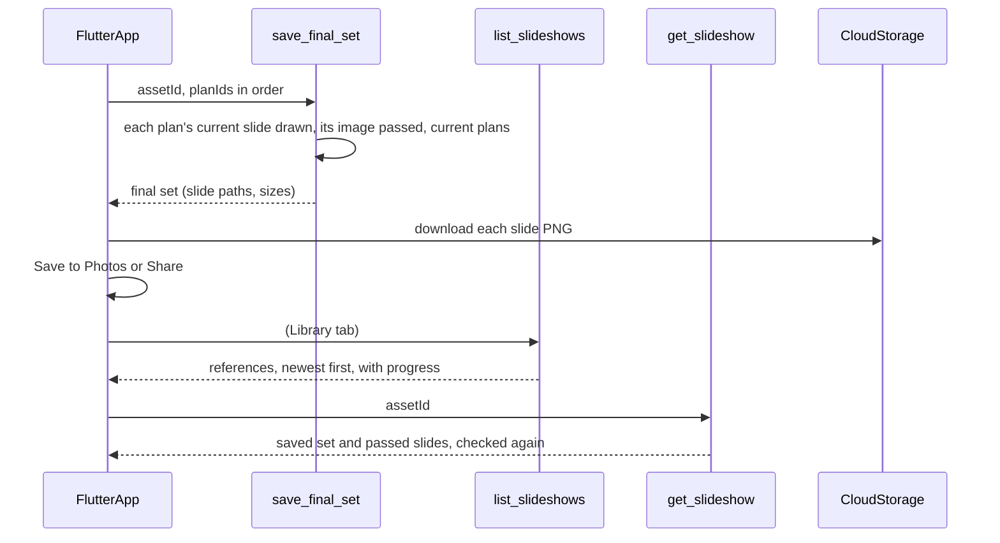

# Phase 9: the final set, export, and the Library

Turns the slides that passed their checks into something you can keep. On the
Variations screen you pick which passed slides go into the set and in what
order, and the server saves that **final set**. You can then save the set to
Photos or share it, as the exact PNG files you previewed. The **Library** tab
lists every reference you've worked on, newest first, and opens its saved set
again later. Phase 8 (automatic retries and duplicate filtering) is skipped for
now, as the backend plan allows. The phases are described in
[`v1-backend-plan.md`](v1-backend-plan.md).

## Build checklist

- [x] Close the gap for images that didn't pass (rules and asset fields; see
      Conflicts), with backend tests (rules are checked by hand; see
      Verification)
- [x] Function: `save_final_set` in `functions/main.py`, with tests
- [x] Functions: `list_slideshows` and `get_slideshow`, with tests
- [x] App: **Review set** on the Variations screen and a new Final set screen
      (pick, order, save), with tests
- [x] App: **Save to Photos** and **Share** (`gal` and `share_plus`), the Photos
      permission text on iOS, with tests through a fake exporter
- [x] App: the Library tab and a Slideshow screen, with tests
- [ ] Deploy (`firebase deploy --only functions,firestore,storage`)
- [ ] Simulator and TestFlight checks, including saving to Photos on a device

## Built differently from this plan

- **One screen instead of two.** The Final set screen and the Slideshow screen
  are the same `SlideshowScreen`, loaded from `get_slideshow`. Opened from
  **Review set** or from a Library card, it lists the current passed slides to
  tick and order. When the plans have changed since, it shows the saved set
  read-only, and it can still be exported.
- **Export needs the screen to match the saved set.** After you reorder,
  untick, or restyle a slide, Save to Photos and Share are hidden until you
  save the set again, so the export is always exactly what's on screen.
- **Review set** turns on once a slide has been drawn on a passed image (not
  just once an image passed), because the server only accepts drawn slides.
- The three functions have a 20-second timeout, not 10.
- On Android, saving to the gallery on Android 10 and older needs
  `WRITE_EXTERNAL_STORAGE` (up to SDK 29) and `requestLegacyExternalStorage`,
  per the `gal` setup.

## Decisions

- **The set is chosen by you, not ranked by a model.** The backend plan
  suggests scoring and ranking. Phase 7 deliberately has no scores, because a
  model's scores aren't calibrated, so there's nothing reliable to rank by. The
  set starts as every passed slide in plan order; you can untick slides and
  move them up or down. Ranking can be added later if it earns its place.
- **The server decides what's in the set.** The app sends only plan IDs, in
  order. For each one, the server takes that plan's current slide and checks
  that the slide was drawn successfully, that its image passed its check, that
  it belongs to you, and that it was made from the current plans. The app never
  sends file paths. Anything that fails is refused with a reason, and nothing is
  saved.
- **A saved set is a snapshot.** It records which slide files were saved.
  Restyling a slide afterwards doesn't change the saved set until you save it
  again.
- **Export is the preview file.** Save to Photos and Share use the same PNG the
  app shows, downloaded from Storage, so what you see is what you get. Slides
  are exported at the size they were made (for example 704×1536); see
  Conflicts.
- **The Library lists references, newest first.** Each card shows the reference
  image, the date, how far you got (analyzed, blueprint saved, plans saved, N
  slides passed, set saved) and the set's size. Tapping one opens a Slideshow
  screen with the saved set and its Save to Photos and Share buttons, or, with
  no set saved, the passed slides and a note to save a set from the Create
  flow.
- **All of this goes through Cloud Functions.** The app still never reads
  Firestore directly, which lets the server keep filtering out anything that
  didn't pass.

## Conflicts flagged, and how they are resolved

- **Images that didn't pass can be reached today, outside inspection.**
  `generationRuns` records and the asset's `variations.{planId}` field are
  readable by the owner and hold the Storage path of every image, including
  rejected ones, and the Storage rules let the owner read (and list) the
  `variations/` folder. The app doesn't use any of this, but it breaks the rule
  that unvalidated results are never handed out. Fix in this phase:
  - Firestore: no client reads at all, for assets and every run record. The
    app doesn't read Firestore, so nothing breaks, and it also hides raw model
    output, which is meant to reach only inspection builds.
  - `variations.{planId}.imagePath` on the asset is written only for passed
    images.
  - Storage: `variations/` and `slides/` allow `get` but not `list`, so a file
    can only be fetched with a path the server handed out. The server hands out
    paths of images that didn't pass only when `EXPOSE_RAW_ANALYSIS` is on.
- **The backend plan ranks results by score.** Not done; see Decisions.
- **Export size is below a phone screen.** Slides are 704×1536, while the
  reference was 1179×2556. The layout is fractional, so the text would scale
  cleanly, but the generated image itself is that size. Asking the image model
  for a larger size (at a higher cost; its size limits need checking first) or
  upscaling are follow-ups, decided after looking at exported slides on a
  phone.
- **You can't continue editing from the Library.** The Create screens are built
  around a session that starts with a local photo. Reopening a reference at its
  blueprint or plans step needs those screens to load from the server instead.
  That's a follow-up; this phase reopens saved sets only.
- **The Library needs a Firestore index** on `uid` and `updatedAt`, added to
  `firestore.indexes.json`.

## Flow

## Records

On the asset:

- `finalSet`: `version`, `savedAt`, and `slides`, each with `planId`,
  `renderId`, `generationRunId`, `imagePath`, `width`, `height`
- `finalSetVersion`, increased on every save

## Functions

- `save_final_set(assetId, planIds)`: 1 to 5 plan IDs, no repeats, each a
  confirmed plan. The plans must be current (not from an earlier blueprint).
  Each plan needs a current slide whose render succeeded and whose image
  passed. Otherwise it fails with, for example, "Plan 2 has no slide that
  passed its checks." 256 MB memory, 20-second timeout, at most 5 instances.
  No daily limit (no model, no images made).
- `list_slideshows()`: your 50 most recently updated references, each with
  `assetId`, `createdAt`, `updatedAt`, the reference image path, the furthest
  step reached, the number of passed slides and the saved set's size.
- `get_slideshow(assetId)`: the reference image path, the saved set (each slide
  checked again: still yours, its image still `passed`), and the current
  passed slides with each plan's title and text.

## App

- **Variations screen:** a **Review set** button at the bottom, enabled once
  at least one slide has passed and none are still being made.
- **Final set screen:** the passed slides as a list of thumbnails, each with a
  checkbox and up and down arrows. **Save set** calls `save_final_set`. Once
  saved, **Save to Photos** and **Share** appear.
- **Save to Photos:** downloads every slide in the set, saves them in order
  with `gal`, then says "Saved 4 slides to Photos". The first time, iOS asks
  for permission with: "Save your finished slides to your photo library."
  (`NSPhotoLibraryAddUsageDescription`). If permission is refused, the app
  says how to turn it on in Settings.
- **Share:** downloads the slides and opens the system share sheet with them
  as PNG files, in set order, through `share_plus`.
- **Library tab:** the list described above, with pull to refresh and an empty
  state for no references yet. Tapping a card opens the **Slideshow screen**,
  which has the same Save to Photos and Share buttons as the Final set screen.
- Export goes through a small `SlideExporter` class, so widget tests use a
  fake one instead of Photos and the share sheet.

## Verification

1. Run `pytest` in `functions/`, and the Dart analyzer plus `flutter test`.
   Backend tests cover:
   - `save_final_set` refuses: another user's asset, unknown or repeated plan
     IDs, a plan whose slide failed, a slide whose image was rejected or
     unverified, plans from an earlier blueprint;
   - a saved set keeps its order and its files after a later restyle;
   - `generate_variation` no longer writes the path of an image that didn't
     pass to the asset;
   - `list_slideshows` returns only your references, newest first, at most 50;
   - `get_slideshow` drops set slides whose image no longer counts as passed.
   Rules tests (or manual checks in the emulator) cover: no client Firestore
   reads; Storage `list` refused and `get` allowed for your own files.
2. Deploy with `firebase deploy --only functions,firestore,storage`.
3. On a phone, make a set of 3, reorder it, save it, then Save to Photos and
   check that the Photos app has 3 images in that order, matching the screen.
4. Share the set to Messages or Files and check the files open.
5. Close the app, open the Library, and check the reference appears with
   "3 slides" and the set opens and exports again.

## Follow-ups (not in this phase)

- Continuing to edit a reference from the Library (blueprint, plans, images).
- Larger exports (a bigger image size or upscaling).
- Deleting a reference and its files from the Library.
- Ranking passed slides, if it proves useful.
- Phase 8: automatic corrective retries and duplicate filtering.
